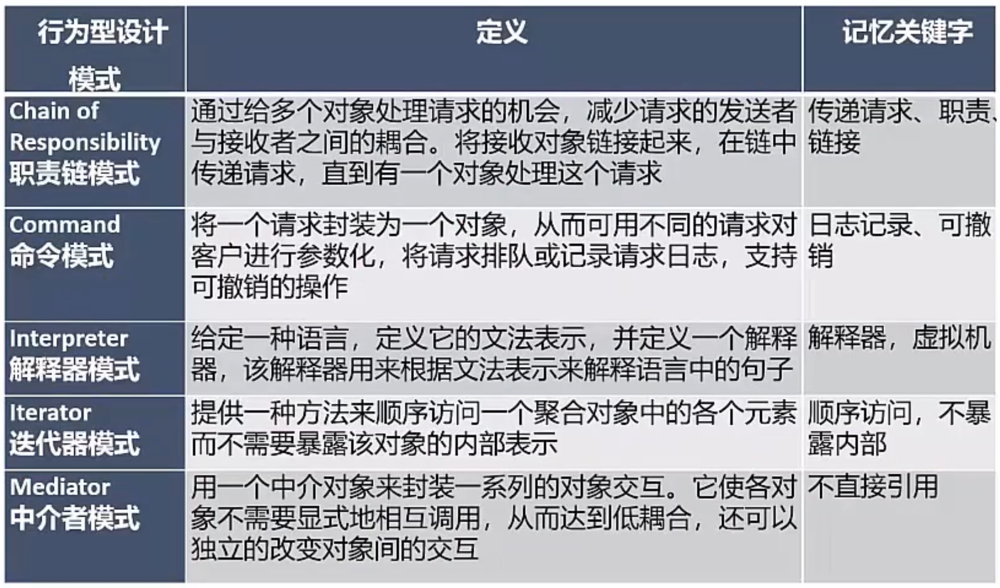
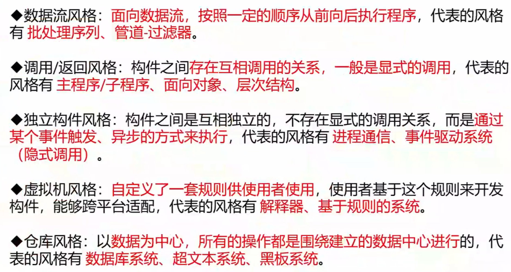

# 关系数据库

## 键/候选键

- **主属性与非主属性：组成候选键的属性就是主属性，其它就是非主属性。**

**求候选键实例**

- 将关系模式的函数依赖关系用”有向图“的方式表示。
- 找入度为0的属性，并以该属性集合为起点，尝试遍历有向图，若能正常遍历图中所有结点，则该属性集即为关系模式的候选键。
- 若入度为0的属性集不能遍历图中所有节点，则需要尝试性的将一些中间节点（既有入度，也有出度的结点）加入入度为0的属性集合中，直至该集合能遍历所有结点，集合为候选键。

## 函数依赖 Armstrong 公理

## 规范化理论（关系范式）

1. **第一范式（1NF）**：**在关系模式R中，当且仅当所有域只包含原子值，既每个属性都是不可再分的数据项，则关系模式R属于第一范式**。

   例如：以下不满足1NF，高级职称人数可以再分教授和副教授。

   

2. **第二范式（2NF）**：**若关系模式R ∈ 1NF，且每个非主属性完全依赖主码时（不存在部分依赖），则关系模式R属于第二范式**。

   例如：以下不满足2NF，课程号可以包含学分。

   

3. **第三范式（3NF）**：**若关系模式R ∈ 2NF，且没有非主属性对主码的传递函数依赖。则关系模式R属于第三范式**。

   例如：以下不满足3NF，系名和系位置依赖系号。

   

4. **BC范式（BCNF）**：**设R是一个关系模式，F是它的依赖集，R属于BCNF当且仅当其F中每个依赖的决定因素必定包含R的某个候选码**。

   

1. 

   

   

#### 软件性能测试

负载测试：测试超负荷环境中程序是否能够承担。

强度测试：在系统资源特别低的情况下考查软件系统极限运行情况。

容量测试：测试系统同时处理的在线最大用户数量。

#### 软件方法学--软件开发方法

自顶向下：将一个大问题分化成多个可以解决的小问题，然后逐一进行解决。每个问题都会有一个模块去解决它，且每个问题包括抽象步骤和具体步骤。

自底向上：根据系统功能要求，从具体的器件、逻辑部件或者相似系统开始，通过对其进行相互连接、修改和扩大，构成所要求的系统。

形式化方法：采用严格的数学方法，使用形式化规约语言来精确定义软件系统。

非形式化方法：通过自然语言、图形或表格描述软件系统的行为和特性，基于这些描述进行设计和开发。

#### arp命令

# 面向对象开发

## 面向对象需求建模

## 面向对象设计原则

## 面向对象测试

# 统一建模语言UML

## 事物

## 关系*

### 用例图

### 序列图

### 通信图

### 状态图

### 活动图

### 构件图

一个构建可能由多个类组成。

## UML视图

# 设计模式*

1、设计模式分类

2、设计模式应用场景

3、设计模式的图形

## 创建型设计模式

如何创造对象

## 结构型设计模式

描述对象和类之间的组织关系

## 行为型设计模式

反映类或对象的行为

# 项目管理-进度管理

# 软件架构*

## 软件架构概述

### 软件架构设计与生命周期

### 构件技术

## 软件架构风格

### 数据流风格

### 调用/返回风格

### 独立构件风格

### 虚拟机风格

### 仓库（数据共享）风格

### 闭环控制

### C2风格

### 总结

## 层次架构风格

### C/S架构

### B/S架构

### RIA富互联网应用（小程序）

### MVC架构

### MVP架构

### MVVM

## 面向服务的架构风格

## 软件架构复用

### 概念

### DSSA 特定领域的软件架构

### ABSD 基于架构的软件开发

## 质量属性

### 软件系统的质量属性

### 软件架构评估

#### 质量属性

#### 评估

#### 基于场景的架构分析方法SAAM

#### 架构权衡分析法ATAM*

## 中间件

# 软件可靠性

